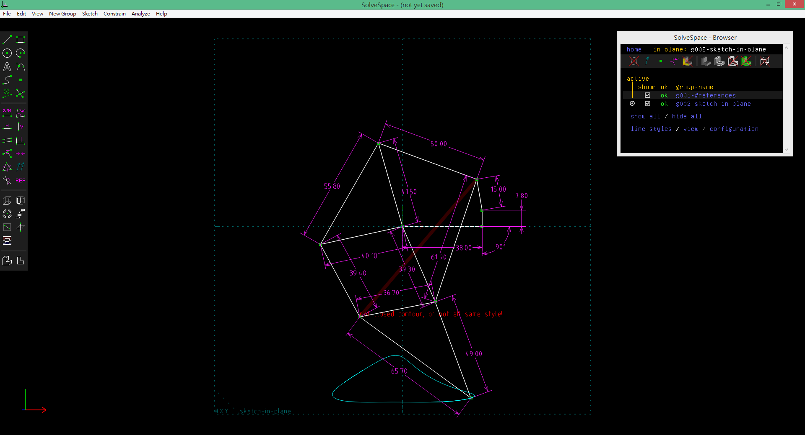
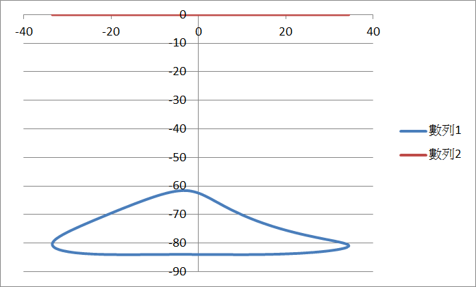

Title: SolveSpace
Date: 1111-02-22 22:22
Category: Misc
Tags: SolveSpace
Author: 40423226

<h2><a href="http://solvespace.com/">SolveSpace</a></h2>
<h2>SolveSpace 2D</h2>
<iframe src="https://player.vimeo.com/video/192920828" width="640" height="428" frameborder="0" webkitallowfullscreen mozallowfullscreen allowfullscreen></iframe>

2D成品

<h2>SolveSpace 3D</h2>
<iframe src="https://player.vimeo.com/video/192920873" width="640" height="428" frameborder="0" webkitallowfullscreen mozallowfullscreen allowfullscreen></iframe>

3D成品

<h2>Linkages</h2>
<iframe src="https://player.vimeo.com/video/195902223" width="640" height="428" frameborder="0" webkitallowfullscreen mozallowfullscreen allowfullscreen></iframe>

尺寸

路徑

Python3 平面四連桿機構模擬

<canvas id="fourbar" width="600" height="400"></canvas>

<!-- 導入 Brython 標準程式庫 -->

<!-- 啟動 Brython -->

<!-- 以下實際利用  Brython 畫兩條直線 -->

<canvas id="fourbar" width="600" height="400"></canvas>

<h2>用SolveSpace把檔案存成html檔,並且更改成http設定,利用嵌入網頁的指令,把html檔案放進網誌裡面</h2>
<pre>&lt;iframe src="<u>檔案的相對位置</u>" width="800" height="600">&lt;/iframe></pre>
<iframe src="https://player.vimeo.com/video/194948275" width="640" height="347" frameborder="0" webkitallowfullscreen mozallowfullscreen allowfullscreen></iframe>